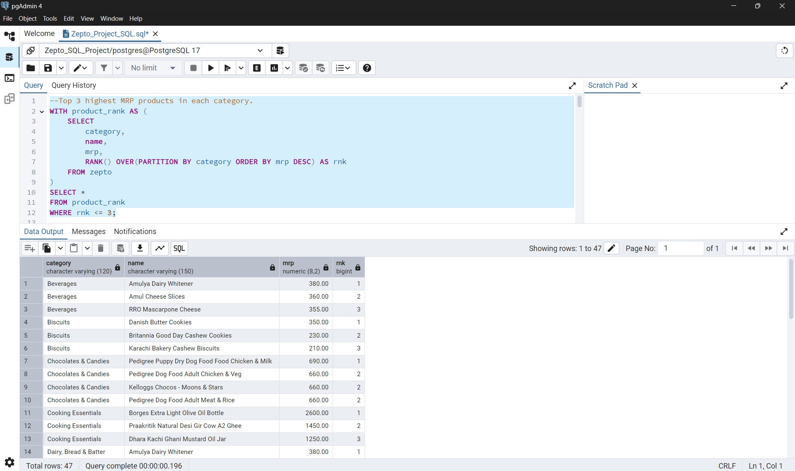
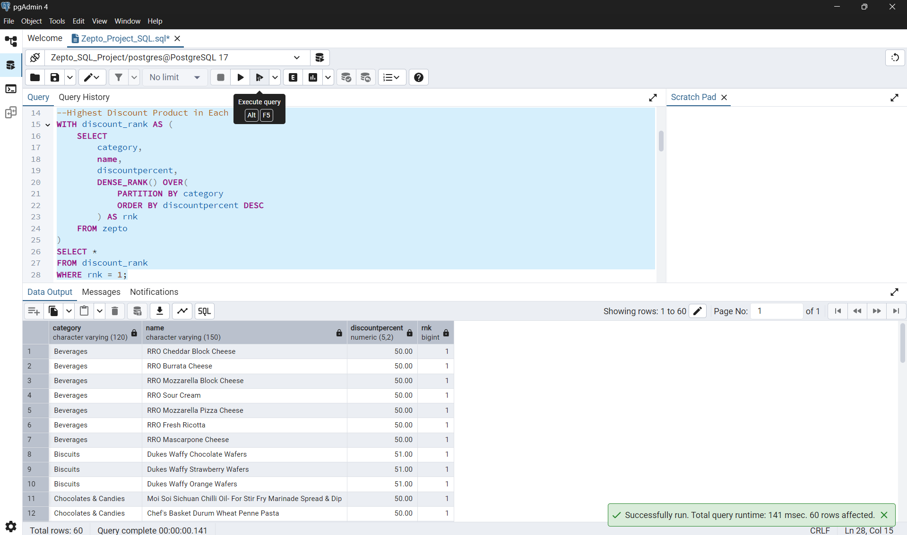
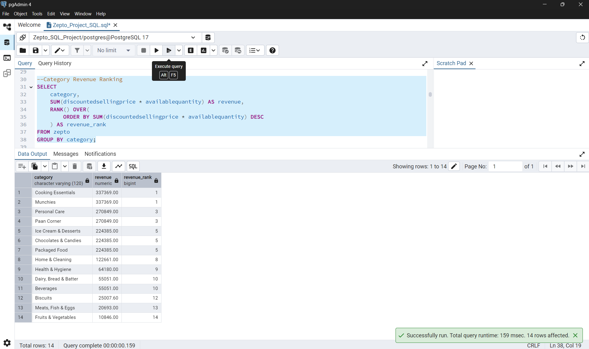

# Zepto Inventory & Sales Analysis Using PostgreSQL

## Project Overview

This project analyzes Zepto inventory and sales data using PostgreSQL. The objective is to extract meaningful business insights related to product categories, revenue generation, discounts, inventory value, and stock availability.

## Tools Used

* PostgreSQL
* pgAdmin 4
* SQL

## Dataset Information

The dataset contains product-level information including:

* Product Name
* Category
* MRP
* Discount Percentage
* Discounted Selling Price
* Available Quantity
* Stock Status

## Business Questions Solved

### Product Analysis

* Identify the top 3 highest MRP products in each category.
* Find the highest discount product in each category.
* Identify the top 5 products by revenue.

### Revenue Analysis

* Rank product categories based on total revenue generated.
* Calculate revenue contribution percentage by category.
* Identify products with the highest inventory value.

### Discount Analysis

* Determine categories offering the highest average discounts.

### Inventory Analysis

* Analyze out-of-stock products by category.
* Identify categories with the highest number of out-of-stock products.

### Category Analysis

* Count the number of products available in each category.

## SQL Concepts Used

* Aggregate Functions
* GROUP BY
* ORDER BY
* Common Table Expressions (CTEs)
* Window Functions
* RANK()
* DENSE_RANK()
* Data Cleaning
* Business-Oriented Analysis

## Key Insights

* Identified top-performing categories based on revenue generation.
* Evaluated discount strategies across categories.
* Analyzed inventory risks through stock availability metrics.
* Ranked premium products based on MRP and revenue contribution.

## Conclusion

This project demonstrates practical SQL skills for data analysis, including data exploration, business analysis, ranking techniques, inventory assessment, and revenue analytics using PostgreSQL.

## Sample Query Outputs

### Top 3 Highest MRP Products in Each Category

### Highest Discount Product in Each Category

### Category Revenue Ranking

